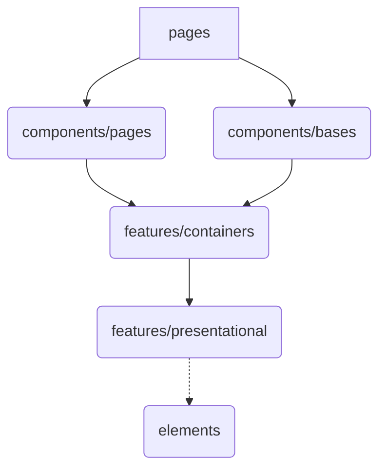

# フロー



# ディレクトリ構成

```
src
├── features
│   ├── containers
│   │   └── xxx.tsx
│   └── presentationals
│       └── xxx.tsx
├── app
│   ├── xxx.tsx
│   └── yyy
│       └── zzz.tsx
├── hooks
│   └── useXxx.tsx
├── components
│   ├── base
│   │   └── header
│   │       ├── index.tsx
│   │       └── index.stories.tsx
│   └── pages
│       └── xxxPage
│           ├── index.tsx
│           └── index.stories.tsx
└── elements
    └── xxx
        ├── index.tsx
        └── index.stories.tsx
```

## `features`

### `containers`

- ロジックと状態を管理し、それらをUIコンポーネントに渡す
- UIに関する処理は一切持たない

### `presentationals`

- containersから受け取ったロジックと状態をUIとして表示する
- ロジックと状態に関する処理は一切持たない

## `app`

- 表示されるページを管理
- `features/containers`を組み合わせて一枚のページを表現する

## `hooks`

- データフェッチのためのカスタムフック
- 一つのフェッチに対して一つのフックスを定義する

## `components`

### `base`

- ページ間で共有して用いられるコンポーネントを管理
  - ヘッダー＆フッターなど

### `pages`

- それぞれのページ固有で持つコンポーネントを管理

### `elements`

- ページ間で再利用されて使われる部品を管理
  - ボタン・テキストフィールドなど
